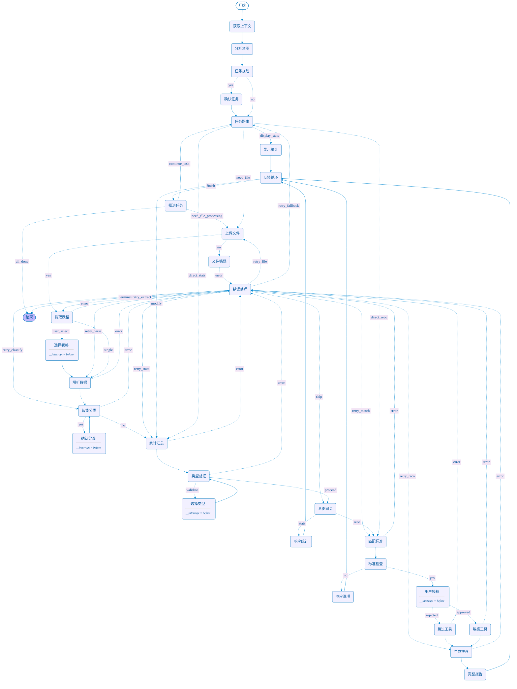

# 仪表识别与推荐安装方法工程智能体

基于LangGraph框架的智能体系统，用于自动识别施工图Excel中的仪表型号、统计数量，并基于国家标准推荐安装方法和材料。

## 🌟 系统特点

- **基于LangGraph框架**：使用标准的`@tool`装饰器和工具系统
- **模块化设计**：清晰的功能分离和依赖管理
- **规则+LLM混合**：结合规则匹配和大语言模型的智能分类
- **增强RAG检索**：基于FAISS的智能安装规范检索系统
- **智能分割优化**：支持多层级文档结构和章节标题识别
- **精确重试机制**：错误时直接重试失败节点，提高系统稳定性

## 🏗️ 项目结构

```
project/
├── tools/                      # LangGraph工具模块
│   ├── langgraph_tools.py      # 标准@tool装饰器工具
│   ├── extract_excel_tables.py # Excel表格提取
│   ├── parse_instrument_table.py # 数据解析与清洗
│   ├── classify_instrument_type.py # 仪表类型分类
│   ├── summarize_statistics.py # 统计汇总
│   ├── build_index.py          # 向量索引构建
│   ├── match_standard_clause.py # 规范条款检索
│   ├── enhanced_rag_retriever.py # 增强RAG检索器
│   ├── enhanced_installation_generator.py # 增强安装推荐生成
│   └── generate_installation_recommendation.py # 安装推荐生成
├── agents/                     # 智能体模块
│   └── instrument_agent.py     # LangGraph主智能体
├── data/                       # 数据存储
│   ├── standards/              # 安装规范文档
│   ├── indexes/                # FAISS向量索引
│   └── uploads/                # 用户上传文件
├── config/                     # 配置模块
│   └── settings.py             # 系统配置
├── evaluation/                 # 评价体系
│   └── comprehensive_evaluation_metrics.py # 综合评价指标
├── recommendation/             # 推荐输出
├── run.py                      # 系统运行入口
├── requirements.txt            # 项目依赖
└── README.md                   # 项目说明
```

## 🔧 LangGraph工具系统

本项目严格遵循LangGraph框架标准，所有工具函数都使用`@tool`装饰器：

```python
from langchain_core.tools import tool

@tool
def extract_excel_tables(file_path: str, keyword: str = "仪表清单") -> Dict[str, Any]:
    """
    从Excel文件中提取包含指定关键字的表格数据
    
    Args:
        file_path: Excel文件路径
        keyword: 识别关键字，默认为"仪表清单"
    
    Returns:
        包含提取结果的字典：{"success": bool, "tables": List[Dict], "message": str}
    """
    # 工具实现...
```

### 工具列表

| 工具名称 | 功能描述 | 优化特点 |
|---------|---------|---------|
| `extract_excel_tables` | Excel表格提取 | 智能表格识别 |
| `parse_instrument_table` | 仪表数据解析 | 复杂数量格式解析 |
| `classify_instrument_types` | 仪表类型分类 | 规则+LLM混合分类 |
| `summarize_instrument_statistics` | 统计汇总 | 数据一致性验证 |
| `match_installation_standards` | 安装规范匹配 | 增强RAG检索 |
| `generate_installation_recommendations` | 安装推荐生成 | 专业化内容生成 |
| `generate_final_report` | 最终报告生成 | 结构化输出 |

## 🚀 快速开始

### 1. 安装依赖

```bash
pip install -r requirements.txt
```

### 2. 配置环境变量

创建`.env`文件：

```env
OPENAI_API_KEY=your_openai_api_key
OPENAI_BASE_URL=https://api.openai.com/v1
LLM_MODEL=gpt-4o-mini
EMBEDDING_MODEL=shibing624/text2vec-base-chinese
FAISS_INDEX_PATH=./data/indexes/instrument_standards.index
```

### 3. 构建向量索引

```bash
python tools/build_index.py --mode rebuild
```

### 4. 运行系统

```bash
python run.py
```

## 📊 工作流程

LangGraph智能体包含以下节点和工作流：



## 🛠️ 核心功能

### 1. Excel表格智能提取解析
- 支持多种Excel格式(.xlsx, .xls)
- 智能识别包含"仪表清单"关键字的表格
- 自动处理多sheet文件

### 2. 仪表类型智能分类
- 规则匹配：基于型号前缀和关键词
- LLM分类：处理复杂和模糊型号
- 支持温度、压力、流量、液位等主要仪表类型

### 3. 增强RAG检索系统
- **FAISS向量数据库**：高效语义检索
- **智能文档分割**：支持多层级标题结构（一级到四级标题）
- **查询增强技术**：基于仪表类型的智能查询扩展
- **重排序机制**：综合相似度和内容质量的智能排序
- **15条候选标准**：从8条增加到15条，提供更丰富的参考

### 4. 专业安装推荐
1. 基于国家标准的安装方法

2. 材料清单和安装步骤

3. 维护保养建议

4. 安全注意事项


### 6. 施工推荐方案综合质量评估系统

​	为了客观评估智能体生成的仪表安装推荐文档质量，本研究构建了一个多维度、可量化的综合评价体系。该体系从内容完整性、现场可操作性和专业质量三个维度对生成结果进行全面评估。综合评价体系采用三级评价框架：内容覆盖类指标、可行性-可操作性类指标和质量评审类指标，分别从不同角度评估生成文档的质量。

## 🔍 处理模式

1. **完整分析模式**：提供完整的统计分析和安装推荐
2. **仅统计模式**：只进行仪表统计，不生成安装推荐
3. **快速预览模式**：快速提取和分类，用于文件验证

## 📄 许可证

本项目采用MIT许可证。详见[LICENSE](LICENSE)文件。

## 🙏 致谢

感谢以下开源项目的支持：
- [LangChain](https://github.com/langchain-ai/langchain)
- [LangGraph](https://github.com/langchain-ai/langgraph)
- [FAISS](https://github.com/facebookresearch/faiss)
- [sentence-transformers](https://www.sbert.net/)
- [OpenAI](https://openai.com/) 