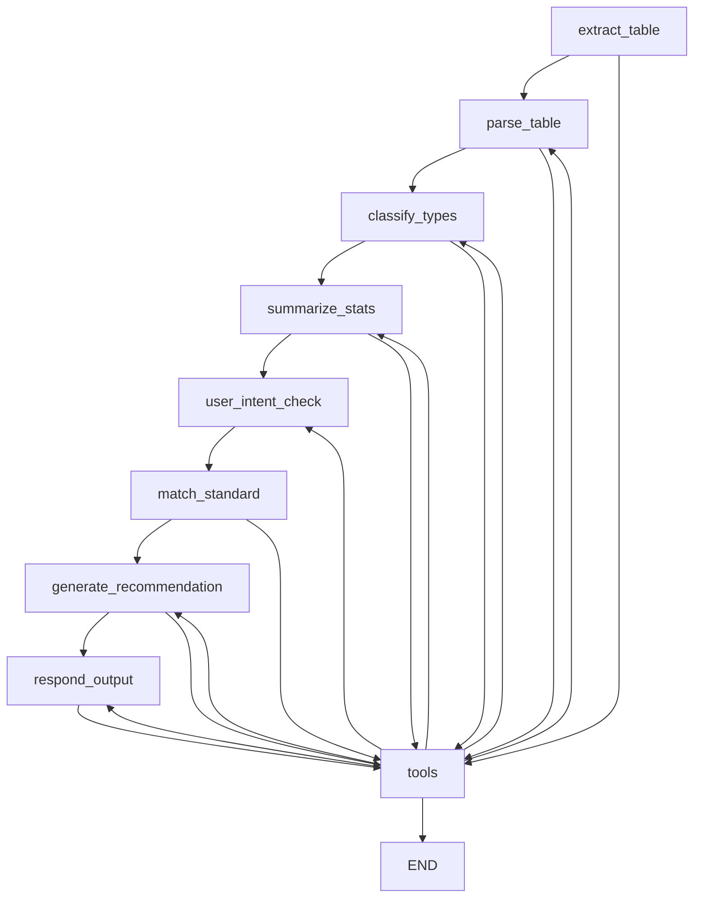

# 仪表识别与推荐安装方法工程智能体

基于LangGraph框架的智能体系统，用于自动识别施工图Excel中的仪表型号、统计数量，并基于国家标准推荐安装方法和材料。

## 🌟 系统特点

- **基于LangGraph框架**：使用标准的`@tool`装饰器和工具系统
- **模块化设计**：清晰的功能分离和依赖管理
- **规则+LLM混合**：结合规则匹配和大语言模型的智能分类
- **RAG向量检索**：基于FAISS的安装规范检索系统
- **友好的Web界面**：基于Streamlit的用户界面

## 🏗️ 项目结构

```
project/
├── tools/                      # LangGraph工具模块
│   ├── langgraph_tools.py      # 标准@tool装饰器工具
│   ├── extract_excel_tables.py # Excel表格提取
│   ├── parse_instrument_table.py # 数据解析与清洗
│   ├── classify_instrument_type.py # 仪表类型分类
│   ├── summarize_statistics.py # 统计汇总
│   ├── build_index.py          # 向量索引构建
│   ├── match_standard_clause.py # 规范条款检索
│   └── generate_installation_recommendation.py # 安装推荐生成
├── agents/                     # 智能体模块
│   └── instrument_agent.py     # LangGraph主智能体
├── data/                       # 数据存储
│   ├── standards/              # 安装规范文档
│   ├── indexes/                # FAISS向量索引
│   └── uploads/                # 用户上传文件
├── config/                     # 配置模块
│   └── settings.py             # 系统配置
├── prompts/                    # 提示词模板
├── main.py                     # Streamlit主程序
├── test_system.py              # 系统测试
├── requirements.txt            # 项目依赖
└── README.md                   # 项目说明
```

## 🔧 LangGraph工具系统

本项目严格遵循LangGraph框架标准，所有工具函数都使用`@tool`装饰器：

```python
from langchain_core.tools import tool

@tool
def extract_excel_tables(file_path: str, keyword: str = "仪表清单") -> Dict[str, Any]:
    """
    从Excel文件中提取包含指定关键字的表格数据
    
    Args:
        file_path: Excel文件路径
        keyword: 识别关键字，默认为"仪表清单"
    
    Returns:
        包含提取结果的字典：{"success": bool, "tables": List[Dict], "message": str}
    """
    # 工具实现...
```

### 工具列表

| 工具名称 | 功能描述 |
|---------|---------|
| `extract_excel_tables` | Excel表格提取 |
| `parse_instrument_table` | 仪表数据解析 |
| `classify_instrument_types` | 仪表类型分类 |
| `summarize_instrument_statistics` | 统计汇总 |
| `match_installation_standards` | 安装规范匹配 |
| `generate_installation_recommendations` | 安装推荐生成 |
| `generate_final_report` | 最终报告生成 |

## 🚀 快速开始

### 1. 安装依赖

```bash
pip install -r requirements.txt
```

### 2. 配置环境变量

创建`.env`文件：

```env
OPENAI_API_KEY=your_openai_api_key
OPENAI_MODEL=gpt-3.5-turbo
FAISS_INDEX_PATH=./data/indexes/standards_index
```

### 3. 运行系统测试

```bash
python test_system.py
```

### 4. 启动Web界面

```bash
streamlit run main.py
```

## 📊 工作流程

LangGraph智能体包含以下节点和工作流：



## 🛠️ 核心功能

### 1. Excel表格智能提取
- 支持多种Excel格式(.xlsx, .xls)
- 智能识别包含"仪表清单"关键字的表格
- 自动处理多sheet文件

### 2. 数量字段智能解析
- 支持各种数量格式：`1×2`, `2X2`, `3x1`, `2*3+1`, `5台`等
- 自动计算总数量
- 数据验证和错误处理

### 3. 仪表类型智能分类
- 规则匹配：基于型号前缀和关键词
- LLM分类：处理复杂和模糊型号
- 支持温度、压力、流量、液位等主要仪表类型

### 4. 安装规范RAG检索
- FAISS向量数据库
- sentence-transformers语义检索
- 综合规范信息提取

### 5. 专业安装推荐
- 基于国家标准的安装方法
- 材料清单和安装步骤
- 维护保养建议

## 📋 支持的仪表类型

- **温度仪表**：热电偶、热电阻、温度变送器
- **压力仪表**：压力表、差压表、压力变送器
- **流量仪表**：电磁流量计、涡街流量计、孔板流量计
- **液位仪表**：液位计、液位变送器、浮球开关
- **分析仪表**：pH计、电导率仪、溶氧仪
- **控制阀门**：调节阀、球阀、蝶阀
- **显示仪表**：数显表、记录仪、控制器

## 🔍 处理模式

1. **完整分析模式**：提供完整的统计分析和安装推荐
2. **仅统计模式**：只进行仪表统计，不生成安装推荐
3. **快速预览模式**：快速提取和分类，用于文件验证

## 🏆 技术亮点

1. **LangGraph标准实践**：完全符合LangGraph框架规范
2. **工具系统**：使用`@tool`装饰器和ToolNode
3. **状态管理**：TypedDict状态定义和条件路由
4. **错误处理**：完善的错误处理和恢复机制
5. **模块化设计**：清晰的功能分离，易于扩展

## 📈 扩展指南

### 添加新的仪表类型

1. 在`config/settings.py`中添加型号映射
2. 在`tools/classify_instrument_type.py`中添加分类规则
3. 收集相关安装规范文档

### 添加新的LangGraph工具

```python
@tool
def your_new_tool(param: str) -> Dict[str, Any]:
    """
    工具描述
    
    Args:
        param: 参数描述
    
    Returns:
        返回值描述
    """
    # 实现逻辑
    return {"success": True, "data": result}

# 添加到工具列表
INSTRUMENT_TOOLS.append(your_new_tool)
```

## 🤝 贡献指南

1. Fork项目
2. 创建功能分支
3. 提交代码变更
4. 创建Pull Request

## 📄 许可证

本项目采用MIT许可证。详见[LICENSE](LICENSE)文件。

## 🙏 致谢

感谢以下开源项目的支持：
- [LangChain](https://github.com/langchain-ai/langchain)
- [LangGraph](https://github.com/langchain-ai/langgraph)
- [Streamlit](https://streamlit.io/)
- [FAISS](https://github.com/facebookresearch/faiss)
- [sentence-transformers](https://www.sbert.net/) 